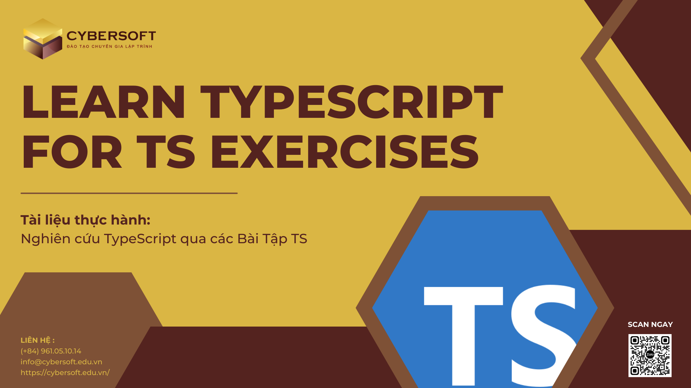

# LEARN TYPESCRIPT FOR TS EXERCISES

_(Tài liệu thực hành: Nghiên cứu TypeScript qua các bài tập TS)_

<div align="center">
	<picture>
		
	</picture>
</div>

## Table of Contents

1. [Giới thiệu](#giới-thiệu)
2. [Trang web chính thức của TypeScript](#trang-web-chính-thức-của-typescript)
3. [Tạo và sử dụng dự án với TypeScript và Vite](#tạo-và-sử-dụng-dự-án-với-typescript-và-vite)
4. [Hướng dẫn xem tham khảo code](#hướng-dẫn-xem-tham-khảo-code)
5. [Tài liệu tham khảo](#tài-liệu-tham-khảo)

## Giới thiệu

Chào mừng bạn đến với hành trình "Học TypeScript qua Bài tập TS"! Trong tài liệu này, chúng ta sẽ khám phá TypeScript, ngôn ngữ lập trình tiên tiến mở rộng từ JavaScript, và áp dụng kiến thức thông qua các bài tập thực hành.

TypeScript giúp nâng cao chất lượng mã nguồn bằng cách tích hợp kiểu dữ liệu tĩnh và các tính năng mạnh mẽ, giúp mã nguồn trở nên an toàn, dễ quản lý và mở rộng. Hãy cùng thực hành và nắm vững những khái niệm cơ bản của TypeScript để áp dụng chúng trong các dự án thực tế.

> Trong repository này, bạn sẽ tìm thấy các bài tập TypeScript và các ví dụ minh họa. Bạn có thể tham khảo và thực hành theo các ví dụ này để nâng cao kiến thức và kỹ năng lập trình của mình.

## Trang web chính thức của TypeScript

Trang web chính thức của TypeScript là nguồn tham khảo chính xác và đáng tin cậy nhất để tìm hiểu về ngôn ngữ này. Tại đây, bạn có thể tìm hiểu về cú pháp, tính năng, và tài liệu hướng dẫn cần thiết để bắt đầu với TypeScript: [typescriptlang.org](https://www.typescriptlang.org/)

## Tạo và sử dụng dự án với TypeScript và Vite

> Tại đây, chúng tôi sẽ hướng dẫn bạn sử dụng dự án Vite để làm việc với TypeScript!

Vite là một công cụ phát triển ứng dụng web nhanh và hiệu quả, được xây dựng trên cơ sở của TypeScript và Vue.js. Với Vite, bạn có thể tạo ra các dự án web hiện đại một cách dễ dàng và linh hoạt.

Bạn có thể tạo dự án TypeScript với Vite bằng cách thực hiện các bước sau:

1. **Tạo thư mục:** Tạo một thư mục mới để chứa dự án TypeScript.

2. **Vào thư mục mới:** Mở terminal trên macOS và Linux hoặc command line trên Windows.

3. **Sử dụng npm:** Gõ lệnh sau để tạo dự án mới với Vite và TypeScript:

   ```bash
   npm create vite@latest typescript -- --template vanilla-ts
   ```

4. **Chạy dự án:** Sau khi tạo dự án thành công, bạn có thể chạy dự án bằng lệnh:

   ```bash
   npm run dev
   ```

Dự án của bạn sẽ được khởi chạy và giao diện sẽ hiển thị trên trình duyệt với đường dẫn http://localhost:5173/.
Hãy chọn Vite để thao tác làm việc với TypeScript dễ dàng hơn.

> Bạn có thể tìm hiểu thêm về Vite tại trang web chính thức: https://vitejs.dev/

Tiếp theo, hãy thiết lập các bước sau:

1. Tạo tệp (File) `tutorial.ts` tại thư mục `src` => `src/tutorial.ts`

2. Tại `main.ts`, thêm dòng import tệp `tutorial.ts `

> Bây giờ, hãy thực hành các kiến thức TypeScript tại tệp tutorial.ts!

## Hướng dẫn xem tham khảo Code

1. _tutorial.ts:_ Đây là tệp xem các phần kiến thức về cấu trúc và cú pháp cơ bản của TypeScript.

2. _test.ts:_ Đây là tệp thực hiện các bài tập thực hành thông qua bộ đề được trích từ [TypeScript Exercises](https://typescript-exercises.github.io/)

## Tài liệu tham khảo

1. [Learn TypeScript for Practical Projects](https://www.freecodecamp.org/news/learn-typescript-for-practical-projects/?ref=dailydev)

2. [TypeScript Exercises](https://typescript-exercises.github.io/)

3. [TypeScript Documentation](https://www.typescriptlang.org/docs/)

4. [TypeScript Roadmap](https://roadmap.sh/typescript)
